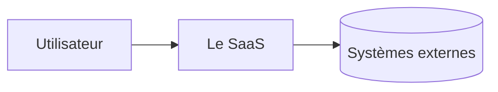
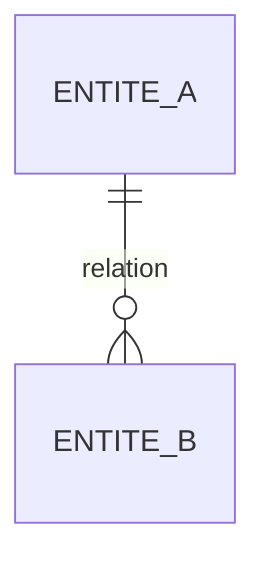

# Architecture technique — <nom du projet>
> Produit par l'étape 9 (rôle CTO). Source de vérité technique pour l'étape 10 (plan) et la Phase 4 (build).
> Archétype : <web-saas> · Date : <AAAA-MM-JJ>

## 1. Synthèse (le COMMENT en 5 lignes)
<L'architecture en une phrase + la stack en une ligne + les 1-2 décisions structurantes. Lisible d'un coup d'œil par un futur agent de build.>

## 2. Matrice des exigences techniques
<Issue du mouvement 2 (`nfr-checklist.md`). Une ligne par feature Must/Should, 8 axes NFR. Chaque exigence tracée à une US + classée dure/molle.>

| Feature | Sécurité/données | Perf | Coût | Scalab. | Fiabilité | Maintenab. | Intégrations | Plateforme |
|---|---|---|---|---|---|---|---|---|
| … | … | … | … | … | … | … | … | … |

- **Exigences socle** (transverses) : <auth, multi-tenant, i18n, paiement…>
- **Exigences dures** (pilotent la stack) : <liste>

## 3. Découpage technique
### 3.1 Contexte (C4 niveau 1)

### 3.2 Conteneurs (C4 niveau 2)
<Blocs déployables (frontend / API / BDD / workers / stockage) + communications.>

### 3.3 Modèle de données

<Pour chaque entité : champs clés, tenant propriétaire, règles RLS (qui lit/écrit).>

### 3.4 Modules (C4 niveau 3, en miroir des features)
<Feature → module(s). Frontières de couplage. Ce qui est parallélisable au build (zones disjointes).>

| Module | Réutilise un bloc (`_shared/blocks/`) | ou Custom (verticale) |
|---|---|---|
| … | `auth` / `billing` / … | — |
| … | — | build custom |

### 3.5 Data flow des workflows cœur
<Pour chaque workflow cœur : entrée → validation → traitement → persistance → sortie. Points asynchrones (jobs/webhooks). Points de défaillance.>

### 3.6 Frontières de confiance & sécurité
<Entrées non fiables (formulaires/uploads/webhooks). authN/authZ. Surfaces publiques vs authentifiées.>

### 3.7 Cas limites
<Par data flow : entrée vide/invalide, échec tiers, double soumission (idempotence), concurrence, état partiel, limite haute.>

## 4. Stack retenue
| Besoin | Choix | Origine |
|---|---|---|
| Web full-stack | Next.js 15 (App Router, TS strict) | [Défaut] |
| BDD + Auth | Supabase (Postgres, RLS, Auth) | [Défaut] |
| … | … | [Défaut] / ADR-NNNN |

## 5. Décisions verrouillées
<Renvoi vers `tech/decisions.md` : liste des ADR + statut. Une ligne par ADR.>

## 6. Risques techniques & taste decisions (pour l'étape 10)
<Risques identifiés (dettes, inconnues, dépendances fragiles) + les rares choix à impact produit à faire trancher à la porte de l'étape 10.>
