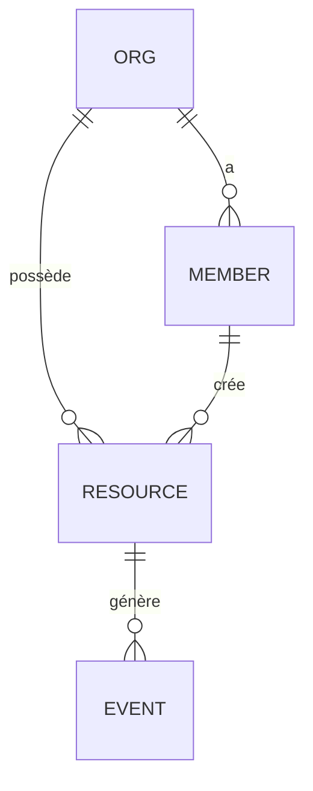

# Référence — Modèle de données, RLS & multi-tenant (mouvement 3, high-stakes)

Le modèle de données est le choix **le plus coûteux à défaire** d'un micro-SaaS : tout le reste (modules, API, UI) s'y adosse, et le changer après le build impose une migration de données. Il mérite donc sa propre procédure normée. Sortie : l'`erDiagram` + les règles RLS de la section 3.3 de `tech/architecture.md`, et l'entrée des migrations `supabase/` (étape 11 / Phase 4).

## Procédure (déterministe)
1. **Dériver les entités** depuis les features + user stories. Un **nom** qui revient dans les US (« projet », « facture », « membre ») = une entité candidate. Une action sur une donnée (« assigner une tâche ») = souvent une relation ou une table de jointure.
2. **Champs clés par entité** : identifiant, propriétaire (le tenant), horodatage, statut, + les champs métier nommés dans les US. Ne mets **que** ce qu'une US justifie (pas de champ « au cas où »).
3. **Relations** : 1-1, 1-N, N-N. Chaque N-N → table de jointure explicite. Marque les relations **de propriété** (cascade) vs **de référence** (restrict).
4. **Tenant & RLS** : pour chaque table, qui est le tenant propriétaire ? Qui lit / écrit ? Écris la **politique RLS** en clair (pas le SQL — la règle : « un membre lit les projets de son org, écrit les siens »).
5. **Cas limites de données** (voir plus bas) : suppression, orphelins, unicité, migration.
6. **Rends l'`erDiagram`** (Mermaid) + la table des politiques RLS dans la section 3.3.

## Choisir la stratégie multi-tenant
Le défaut de l'archétype couvre 95 % des micro-SaaS. Ne dévie que sur exigence dure (`decision-matrices.md §2`).

| Stratégie | Quand | Isolation | Réversibilité |
|---|---|---|---|
| **Shared-table + `tenant_id` + RLS** (défaut) | micro-SaaS B2B/B2C standard | logique (RLS Postgres) | — (c'est le défaut) |
| Schema-per-tenant | conformité imposant l'isolation logique forte | schéma Postgres par tenant | **difficile** (migration) → ADR |
| Base-per-tenant | isolation physique imposée (santé, souveraineté) | base dédiée | **très difficile** → ADR |

> Chaque déviation du défaut = un ADR avec réversibilité honnêtement notée « difficile ». Ne marque **jamais** un choix multi-tenant « réversible : facile ».

## Variante AUTOMATION — tables d'état service-role-only (multi-tenant « sans objet »)

> Conditionnement par archétype. Le modèle à 3 axes (`archetype` / `type` / `tenancy`) et la définition de `automation` vivent en **source unique** dans `_shared/state-schema.md §Modèle à 3 axes`. Ici on ne redéfinit rien : on dérive **ce que devient le modèle de données** quand `archetype = automation`. Toute la procédure « multi-tenant » ci-dessus (dérivation depuis US produit, tenant, RLS, `anon`) est **conçue pour `web-saas`** ; en `automation` elle est **inapplicable telle quelle** — appliquer le multi-tenant à un headless est un **faux-positif** (l'inverse du bug des portes de complétude, §`state-schema.md`).

Un `automation` n'a **pas de schéma applicatif orienté utilisateur** : pas de session, pas de JWT, pas de rôle produit, pas de surface `anon`. Ses tables sont un **état d'automatisation** (config, historique de runs + logs, curseurs d'idempotence, éventuelles entités métier créées par le job), **écrites et lues par le worker seul** via `service_role` (REST `fetch` — cf. `_shared/archetypes/automation.md`, socle AU1-AU5). Conséquences directes sur la procédure :

| Point de la procédure web-saas | En automation |
|---|---|
| **Stratégie multi-tenant** (table ci-dessus) | **sans objet** — pas de tenant, pas d'`org_id`, pas de FK propriétaire. Une seule « organisation » implicite : le worker. Ne pose **pas** de `tenant_id` « au cas où ». |
| **Ligne « Tenant »** de chaque table | **sans objet** — remplace par « écrit/lu par : worker (`service_role`) ». |
| **Règles RLS** (§ suivant) | **RLS activée mais deny-by-default sans policy** : la table est **service-role-only**. `service_role` **bypasse RLS** ; on n'ajoute **aucune** policy `select/insert/update/delete` (aucun rôle non-privilégié n'y accède). Documenter ce choix explicitement (RLS ON + 0 policy = « accès worker uniquement », pas un oubli). |
| **Frontière de confiance JWT** | **sans objet** — il n'y a pas de client à qui ne pas faire confiance. Les secrets d'intégration (token boutique, clé Resend) sont la seule frontière, portée par la config (AU1), pas par RLS. |
| **Surface `anon`** | **sans objet** — un headless n'expose **rien** à `anon`. Tout le bloc « Accès public anonyme » est ignoré (l'admin optionnel de statut/logs se protège par accès restreint, pas par un signup public). |

### L'invariant d'ENTITÉ idempotente est en 1er rang (avant tout le reste)
En web-saas, le premier invariant listé est souvent l'unicité **par tenant**. En automation, **le risque n°1 — et donc le premier invariant à poser** — est l'**idempotence au grain de l'entité** que le job crée : « un même déclencheur métier (ex. un manque de stock) ne doit produire **au plus une** entité ouverte (ex. un réappro), même si le run est rejoué ». C'est distinct de l'idempotence de **run** (AU5 `withIdempotency` : « un effet au plus par tick ») : le grain **entité** exige sa propre contrainte DB. Pose-le **en tête** de la table des invariants d'intégrité, avec :

| Invariant (grain entité) | Contrainte DB | Jamais |
|---|---|---|
| Au plus une entité ouverte par déclencheur métier (au plus un réappro par manque) | **index unique partiel** sur la **clé d'identité déterministe** `WHERE statut = 'ouvert'` + **upsert RPC atomique** (`insert … on conflict … do nothing/update`) | `SELECT` « existe-t-il déjà ? » puis `INSERT` (course : deux runs concurrents passent tous deux) |

- **Clé d'identité déterministe = attributs STABLES seulement.** La clé qui identifie l'entité **exclut toute quantité mutable**. Un `sha256(sku | besoin | fenêtre)` qui inclut la quantité manquante re-crée un doublon **dès que la quantité change** au run suivant — piège classique. La clé porte l'**identité** (quoi/où/quelle fenêtre), pas l'**état** (combien). Le patron complet 2-grains (run vs entité) + migration exemple vivent dans le socle automation (`_shared/archetypes/automation.md` AU5 + `_shared/blocks/automation/README.md`) — on ne le duplique pas ici, on **exige** sa contrainte au modèle.
- **Fenêtre déterministe** (le composant temporel de la clé) : ne **jamais** utiliser `now()` nu dans la clé (chaque run tombe dans un bucket différent → l'idempotence ne tient pas). Bucketise sur une **fenêtre calculée** : `floor((epoch(t) − EPOCH_CONSTANTE) / PÉRIODE_SEC)`, avec `EPOCH_CONSTANTE` **fixe** (constante versionnée du code, jamais l'heure de démarrage) et un **préfixe versionné** (`ss:v1:sync:…`) pour pouvoir changer de schéma de fenêtre sans collision. La période DOIT dériver de la **cadence réelle** du worker (piège de la fenêtre 24 h par défaut du châssis — cf. socle automation).

### RETURNING est SÛR sur table service-role-only (le piège RLS n'existe que sous policy SELECT auto-référente)
Le piège « `new row violates row-level security policy` au premier `INSERT` » — celui qui casse `.insert().select()` — **n'existe QUE** quand une **policy `SELECT` auto-référente** (qui re-requête sa propre table pour décider de la visibilité) s'applique au `RETURNING`. Un `INSERT … RETURNING` (côté SDK : `.insert(…).select()`) fait passer les lignes retournées **par la policy `SELECT`** ; si cette policy re-lit la table (ex. « je vois la ligne si j'appartiens à son org » alors que l'org vient d'être créée dans le même insert), le check échoue et l'insert entier est rejeté.

Sur une table **service-role-only** (automation) : **il n'y a aucune policy `SELECT`**, et `service_role` **bypasse RLS** de toute façon. Donc **`INSERT … RETURNING` / `.insert().select()` est SÛR** — récupère librement l'id/la ligne insérée, y compris l'upsert d'idempotence d'entité. **Ne transpose PAS** la prudence « RETURNING piégé » du contexte web-saas ici : ce serait une contrainte fantôme. La règle exacte : *le RETURNING n'est risqué que sous une policy SELECT auto-référente ; sans policy SELECT (service-role-only) il est inconditionnellement sûr.*

### Patron « domain store » (REST service-role + fallback fichier)
Le worker parle à ses tables d'état en **REST `service_role`** (pas de SDK lourd — cf. AU5). Le patron réutilisable pour une **entité métier** persistée par le job = un **« domain store »** : un module qui expose `get/upsert/list` sur l'entité, **REST Supabase en primaire** et **fallback fichier local** (`.automation/*.json`) en secours. Deux règles dures sur le fallback :
- **Concurrence** : le fallback fichier ne tient pas sous accès concurrent → n'est valide qu'en mono-instance (le `concurrency` du scheduler garantit un run à la fois).
- **Éphémérité** (⚠️ décisif au déploiement) : sur **runner éphémère** (GitHub Actions, Cloud Scheduler, CI), le disque est **effacé à chaque tick** → `.automation/*.json` disparaît → **l'idempotence d'entité est cassée en silence**. Donc : *fallback fichier valide UNIQUEMENT sur disque persistant OU test local one-shot ; **runner éphémère ⇒ table Supabase durable OBLIGATOIRE***. Cette contrainte **conditionne la reco de déploiement** (§`skills/17-deploy/references/automation-deploy.md`).

Toute fonction/RPC posée pour ce patron (upsert atomique d'idempotence d'entité) reste soumise à **lesson #15** : garde-fou anti-42702 obligatoire (`#variable_conflict use_column` **ou** préfixes `p_`/`v_` + qualification `table.colonne`) — cf. §Robustesse des fonctions PL/pgSQL ci-dessous. Un upsert d'idempotence est typiquement `SECURITY DEFINER` + `RETURNS TABLE` → cible directe du 42702.

## Règles RLS (le socle du multi-tenant sur Supabase)

> Archétype `automation` : ce bloc est **sans objet** (tables service-role-only, RLS ON + 0 policy) — voir §Variante AUTOMATION ci-dessus. Le reste de cette section vaut pour `web-saas`.
- **Toute table tenantée porte `tenant_id`** (ou une FK vers l'org) et **active RLS**. Une table tenantée sans RLS = fuite de données inter-clients → `[SÉCU]`.
- **Deny-by-default** : RLS activée, aucune policy permissive « à tous ». On ajoute les policies `select/insert/update/delete` explicitement.
- **Le tenant vient du token de session**, jamais d'un paramètre client (sinon un client lit les données d'un autre en changeant l'ID). Frontière de confiance : le `tenant_id` de la requête est **dérivé du JWT**, pas du body.
- **Tables non tenantées** (référentiels publics, contenu partagé) : documente-le explicitement — l'absence de RLS y est un **choix**, pas un oubli.
- **Rôles** : si le PRD a des rôles (admin/membre/lecteur), les policies les reflètent (un lecteur ne fait pas d'`update`).

## Micro-exemple (niche-agnostique)

| Table | Tenant | RLS (select / write) |
|---|---|---|
| `org` | soi-même | membre lit son org ; write = admin |
| `member` | `org_id` | lit les membres de son org ; write = admin |
| `resource` | `org_id` | lit celles de son org ; write = créateur ou admin |
| `event` | via `resource.org_id` | lit via la ressource ; write = système (jamais client) |

Lecture : le `tenant_id` effectif (`org_id`) est **toujours** dérivé de la session ; `event` est écrit par le backend (donnée non fiable si écrite par le client).

## Invariants d'intégrité DB (contraintes, jamais des checks applicatifs)
Règle dure : **tout invariant violable par 2 écritures concurrentes est porté par une contrainte DB** — `EXCLUDE` (GiST), `CHECK` ou unique composite — **jamais un check applicatif seul**. Un `SELECT` de vérification suivi d'un `INSERT` est une course : deux requêtes simultanées passent toutes les deux le check et violent l'invariant. Seule la contrainte tient sous concurrence. Invariant métier-critique → `[SÉCU]`.

| Invariant (exemple) | Contrainte DB | Jamais |
|---|---|---|
| Pas de chevauchement (réservation, planning, allocation) | `EXCLUDE USING gist (resource_id WITH =, plage WITH &&)` | check de disponibilité côté app avant insert |
| Unicité par tenant (slug, email, référence) | unique composite `(tenant_id, champ)` | « on vérifie avant d'insérer » |
| Borne métier (quantité ≥ 0, date dans une fenêtre) | `CHECK (…)` | validation zod seule |
| Un seul actif par parent (abonnement courant, défaut) | index unique partiel `WHERE actif` | flag géré par le code |

- **Recette** : pour chaque règle du PRD du type « jamais deux X en même temps / au plus N / dans la fenêtre Y » et chaque cas limite « concurrence », écris la **contrainte SQL** dans la section 3.3 — elle entre en migration à l'étape 11 et devient un test de concurrence en Phase 4.
- La validation applicative (zod, RPC) **s'ajoute** pour les messages d'erreur ; elle ne **remplace** jamais la contrainte.

## Accès public anonyme (surface exposée sans login)
Dès qu'une table, vue ou fonction est accessible au rôle `anon` (page publique, formulaire sans compte), la surface est **attaquable par script** — elle se conçoit ici, pas au build. Tout ce bloc est `[SÉCU]`.

- **Lecture anonyme** : jamais de `GRANT SELECT` sur la table — une **vue ou fonction `SECURITY DEFINER` à colonnes explicites, SANS PII** (pas d'email / téléphone / nom de clients ; colonnes listées une à une, jamais `SELECT *`).
- **Écriture anonyme** : jamais d'insert direct — un **endpoint serveur** (route API / RPC) qui **valide** l'entrée + **rate-limit**.
- **Toute fonction grantée à `anon` ⇒ checklist anti-abus OBLIGATOIRE** (les trois, pas « au choix ») :
  1. **Bornes temporelles** — l'action n'est valable que dans une fenêtre métier (ex. réservable ≤ `now() + 60 jours`) ;
  2. **Plafonds par client** — au plus N objets actifs par identifiant client (email / téléphone) ;
  3. **Rate-limit IP** — au niveau endpoint / middleware.
- Sans ces trois gardes, un script remplit la ressource de n'importe quel tenant = **DoS métier trivial**. Chaque garde est documentée en section 3.3 (elle devient contrainte / code / test aux étapes 11 et Phase 4).

## Robustesse des fonctions PL/pgSQL (collision colonne / variable — bug runtime invisible au build)
Une fonction `plpgsql` **compile toujours** : Postgres ne résout les noms qu'**à l'exécution**. Un nom de **colonne de sortie** (`RETURNS TABLE(… x …)`), de **paramètre** ou de **variable locale** qui porte le **même nom qu'une colonne de table** référencée **sans qualification** lève l'erreur runtime **42702 « column reference … is ambiguous »** — au **premier appel réel**, jamais au build. Ni `tsc` ni `next build` ne voient le SQL : une fonction cœur (réservation, paiement, création de compte) passe toute la CI verte puis **plante au premier vrai clic en prod**. C'est un point `[SÉCU]`/qualité DB.

Règle dure : **toute fonction `plpgsql`** (a fortiori `SECURITY DEFINER` et/ou `RETURNS TABLE`) applique **l'un des deux** garde-fous, jamais aucun :
- **(a) directive `#variable_conflict use_column`** en **tête de corps** (après `as $$`, avant `begin`/`declare`) — un nom ambigu résout alors vers la **colonne** ; **ou**
- **(b) discipline de nommage** : variables locales / paramètres **préfixés `v_` / `p_` / `c_`** (jamais le nom d'une colonne) **ET** **toute référence de colonne qualifiée** `table.colonne` — aucun nom **nu** qui puisse collisionner avec un paramètre OUT, une variable ou une colonne.

Les deux se cumulent volontiers (ceinture + bretelles). Ce qui est **interdit** : un nom **nu** (`hold_expires_at`) dans une fonction où ce nom est **aussi** une colonne de sortie, un paramètre ou une variable.

### Le fix exact (bug réel `create_booking`)
```sql
-- ❌ AVANT — 42702 au premier appel : la colonne OUT `hold_expires_at` de
-- RETURNS TABLE collisionne avec appointments.hold_expires_at, référencée NUE.
create function public.create_booking(slot_id uuid, client_email text)
returns table (id uuid, hold_expires_at timestamptz)
language plpgsql
security definer
set search_path = ''
as $$
begin
  return query
  insert into public.appointments (slot_id, client_email, hold_expires_at)
  values (slot_id, client_email, now() + interval '15 minutes')
  returning appointments.id, hold_expires_at;  -- hold_expires_at AMBIGU (colonne OUT vs colonne table)
end;
$$;

-- ✅ APRÈS — un seul des deux garde-fous suffit ; ici les deux, par sûreté.
create function public.create_booking(p_slot_id uuid, p_client_email text)
returns table (id uuid, hold_expires_at timestamptz)
language plpgsql
security definer
set search_path = ''
as $$
#variable_conflict use_column                                         -- (a) nom ambigu ⇒ colonne
begin
  return query
  insert into public.appointments (slot_id, client_email, hold_expires_at)
  values (p_slot_id, p_client_email, now() + interval '15 minutes')   -- (b) paramètres préfixés p_
  returning appointments.id, appointments.hold_expires_at;            -- (b) colonnes qualifiées
end;
$$;
```
> La collision était sur la **sortie** : `hold_expires_at` (colonne OUT de `RETURNS TABLE`) et `appointments.hold_expires_at` portent le même nom ; **nue** dans le `RETURNING`, la référence devient ambiguë → 42702. Fix : la directive (a) **et** la qualification `appointments.hold_expires_at` (b), plus les paramètres préfixés `p_` par hygiène. Règle mnémotechnique : **dans une fonction, un nom nu ne doit désigner qu'une seule chose.**

- **Recette** : toute fonction posée en section 3.3 (et sa migration `supabase/` à l'étape 11) porte **(a) ou (b)** — c'est un point de revue à la DoD (item DB) et un red-flag de sa checklist.
- **Preuve** : le build **ne l'attrape pas** ; seul un **smoke-test qui appelle réellement la fonction** contre une vraie base le détecte → porte de la passe d'intégration (`skills/12-build/references/integration-pass.md`, § smoke-test des fonctions/RPC).

## Cas limites de données (à lister explicitement)
Chacun est un test futur (Phase 4) — non listé ici = test manquant plus tard.

| Cas | Question à trancher | Action typique |
|---|---|---|
| Suppression d'un parent | cascade ou restrict ? | propriété → cascade ; référence → restrict + message |
| Orphelins | une ligne peut-elle perdre son tenant ? | FK non-null + `on delete cascade` |
| Unicité | quel champ est unique **par tenant** (pas global) ? | contrainte unique composite `(tenant_id, champ)` |
| Concurrence | 2 écritures simultanées (même ligne ou invariant inter-lignes) | même ligne : `updated_at` / version ; invariant : contrainte DB (§ Invariants d'intégrité DB) |
| Idempotence | événement externe rejoué (webhook) | clé d'idempotence unique (id d'événement) |
| Soft vs hard delete | garder l'historique ? | `deleted_at` si le PRD veut de la corbeille/audit |
| Volumétrie haute | une table grossit sans borne (events, logs) | pagination, index, purge/archivage planifié |
| Migration future | un champ changera souvent (statuts, plan) | enum en table de référence, pas en dur |

## Modes d'échec du modèle de données
- **Sur-modélisation** : 12 tables pour un MVP à 2 features → reviens aux entités que les US **nomment**. Explicite > malin.
- **`tenant_id` client-fourni** : faille d'isolation classique → dérive-le du JWT, taggue `[SÉCU]`.
- **RLS oubliée sur une table tenantée** : fuite inter-clients → deny-by-default, revue à la DoD.
- **Invariant en check applicatif** : « on vérifie avant d'insérer » cède sous concurrence → contrainte `EXCLUDE`/`CHECK`/unique composite (§ Invariants d'intégrité DB), taggue `[SÉCU]`.
- **Surface `anon` sans garde** : fonction grantée à `anon` sans bornes temporelles / plafonds / rate-limit → checklist anti-abus obligatoire (§ Accès public anonyme), taggue `[SÉCU]`.
- **Fonction `plpgsql` à nom collisionnable** : colonne OUT / paramètre / variable homonyme d'une colonne de table référencée nue → 42702 « column reference is ambiguous » au premier appel, **invisible au build** → `#variable_conflict use_column` ou préfixe `v_`/`p_` + qualification systématique (§ Robustesse des fonctions PL/pgSQL) ; prouvé par smoke-test, pas par `tsc`.
- **Entité fantôme** : une table sans US qui la justifie → supprime (choix orphelin).
- **Modèle figé trop tôt** : si une US n'a pas d'entité pour la porter, **itère** avant de figer les modules (M3 boucle interne).

## Handoff
- **Étape 10 (plan)** : chaque entité `crud` → tâche de câblage ; le custom → tâches verticale.
- **Étape 11 (setup)** : le modèle → migrations `supabase/` versionnées.
- **Phase 4 (build)** : les cas limites → matrice de tests ; les points `[SÉCU]` → revue sécurité ; **chaque fonction/RPC → smoke-test contre une vraie base (0 erreur SQL)** avant livraison (`skills/12-build/references/integration-pass.md`) — le garde-fou (a)/(b) se **prouve** là, il ne se relit pas.
