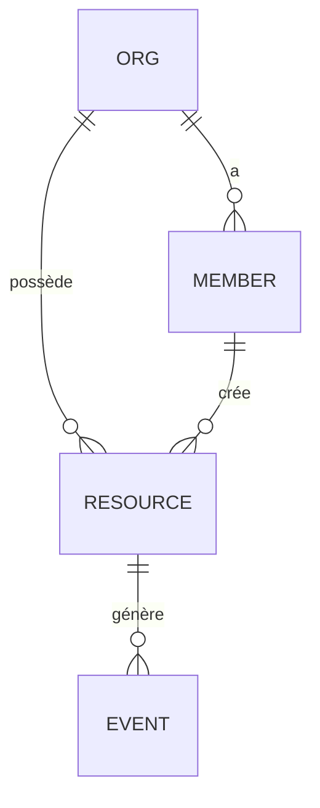

# Référence — Modèle de données, RLS & multi-tenant (mouvement 3, high-stakes)

Le modèle de données est le choix **le plus coûteux à défaire** d'un micro-SaaS : tout le reste (modules, API, UI) s'y adosse, et le changer après le build impose une migration de données. Il mérite donc sa propre procédure normée. Sortie : l'`erDiagram` + les règles RLS de la section 3.3 de `tech/architecture.md`, et l'entrée des migrations `supabase/` (étape 11 / Phase 4).

## Procédure (déterministe)
1. **Dériver les entités** depuis les features + user stories. Un **nom** qui revient dans les US (« projet », « facture », « membre ») = une entité candidate. Une action sur une donnée (« assigner une tâche ») = souvent une relation ou une table de jointure.
2. **Champs clés par entité** : identifiant, propriétaire (le tenant), horodatage, statut, + les champs métier nommés dans les US. Ne mets **que** ce qu'une US justifie (pas de champ « au cas où »).
3. **Relations** : 1-1, 1-N, N-N. Chaque N-N → table de jointure explicite. Marque les relations **de propriété** (cascade) vs **de référence** (restrict).
4. **Tenant & RLS** : pour chaque table, qui est le tenant propriétaire ? Qui lit / écrit ? Écris la **politique RLS** en clair (pas le SQL — la règle : « un membre lit les projets de son org, écrit les siens »).
5. **Cas limites de données** (voir plus bas) : suppression, orphelins, unicité, migration.
6. **Rends l'`erDiagram`** (Mermaid) + la table des politiques RLS dans la section 3.3.

## Choisir la stratégie multi-tenant
Le défaut de l'archétype couvre 95 % des micro-SaaS. Ne dévie que sur exigence dure (`decision-matrices.md §2`).

| Stratégie | Quand | Isolation | Réversibilité |
|---|---|---|---|
| **Shared-table + `tenant_id` + RLS** (défaut) | micro-SaaS B2B/B2C standard | logique (RLS Postgres) | — (c'est le défaut) |
| Schema-per-tenant | conformité imposant l'isolation logique forte | schéma Postgres par tenant | **difficile** (migration) → ADR |
| Base-per-tenant | isolation physique imposée (santé, souveraineté) | base dédiée | **très difficile** → ADR |

> Chaque déviation du défaut = un ADR avec réversibilité honnêtement notée « difficile ». Ne marque **jamais** un choix multi-tenant « réversible : facile ».

## Règles RLS (le socle du multi-tenant sur Supabase)
- **Toute table tenantée porte `tenant_id`** (ou une FK vers l'org) et **active RLS**. Une table tenantée sans RLS = fuite de données inter-clients → `[SÉCU]`.
- **Deny-by-default** : RLS activée, aucune policy permissive « à tous ». On ajoute les policies `select/insert/update/delete` explicitement.
- **Le tenant vient du token de session**, jamais d'un paramètre client (sinon un client lit les données d'un autre en changeant l'ID). Frontière de confiance : le `tenant_id` de la requête est **dérivé du JWT**, pas du body.
- **Tables non tenantées** (référentiels publics, contenu partagé) : documente-le explicitement — l'absence de RLS y est un **choix**, pas un oubli.
- **Rôles** : si le PRD a des rôles (admin/membre/lecteur), les policies les reflètent (un lecteur ne fait pas d'`update`).

## Micro-exemple (niche-agnostique)

| Table | Tenant | RLS (select / write) |
|---|---|---|
| `org` | soi-même | membre lit son org ; write = admin |
| `member` | `org_id` | lit les membres de son org ; write = admin |
| `resource` | `org_id` | lit celles de son org ; write = créateur ou admin |
| `event` | via `resource.org_id` | lit via la ressource ; write = système (jamais client) |

Lecture : le `tenant_id` effectif (`org_id`) est **toujours** dérivé de la session ; `event` est écrit par le backend (donnée non fiable si écrite par le client).

## Invariants d'intégrité DB (contraintes, jamais des checks applicatifs)
Règle dure : **tout invariant violable par 2 écritures concurrentes est porté par une contrainte DB** — `EXCLUDE` (GiST), `CHECK` ou unique composite — **jamais un check applicatif seul**. Un `SELECT` de vérification suivi d'un `INSERT` est une course : deux requêtes simultanées passent toutes les deux le check et violent l'invariant. Seule la contrainte tient sous concurrence. Invariant métier-critique → `[SÉCU]`.

| Invariant (exemple) | Contrainte DB | Jamais |
|---|---|---|
| Pas de chevauchement (réservation, planning, allocation) | `EXCLUDE USING gist (resource_id WITH =, plage WITH &&)` | check de disponibilité côté app avant insert |
| Unicité par tenant (slug, email, référence) | unique composite `(tenant_id, champ)` | « on vérifie avant d'insérer » |
| Borne métier (quantité ≥ 0, date dans une fenêtre) | `CHECK (…)` | validation zod seule |
| Un seul actif par parent (abonnement courant, défaut) | index unique partiel `WHERE actif` | flag géré par le code |

- **Recette** : pour chaque règle du PRD du type « jamais deux X en même temps / au plus N / dans la fenêtre Y » et chaque cas limite « concurrence », écris la **contrainte SQL** dans la section 3.3 — elle entre en migration à l'étape 11 et devient un test de concurrence en Phase 4.
- La validation applicative (zod, RPC) **s'ajoute** pour les messages d'erreur ; elle ne **remplace** jamais la contrainte.

## Accès public anonyme (surface exposée sans login)
Dès qu'une table, vue ou fonction est accessible au rôle `anon` (page publique, formulaire sans compte), la surface est **attaquable par script** — elle se conçoit ici, pas au build. Tout ce bloc est `[SÉCU]`.

- **Lecture anonyme** : jamais de `GRANT SELECT` sur la table — une **vue ou fonction `SECURITY DEFINER` à colonnes explicites, SANS PII** (pas d'email / téléphone / nom de clients ; colonnes listées une à une, jamais `SELECT *`).
- **Écriture anonyme** : jamais d'insert direct — un **endpoint serveur** (route API / RPC) qui **valide** l'entrée + **rate-limit**.
- **Toute fonction grantée à `anon` ⇒ checklist anti-abus OBLIGATOIRE** (les trois, pas « au choix ») :
  1. **Bornes temporelles** — l'action n'est valable que dans une fenêtre métier (ex. réservable ≤ `now() + 60 jours`) ;
  2. **Plafonds par client** — au plus N objets actifs par identifiant client (email / téléphone) ;
  3. **Rate-limit IP** — au niveau endpoint / middleware.
- Sans ces trois gardes, un script remplit la ressource de n'importe quel tenant = **DoS métier trivial**. Chaque garde est documentée en section 3.3 (elle devient contrainte / code / test aux étapes 11 et Phase 4).

## Cas limites de données (à lister explicitement)
Chacun est un test futur (Phase 4) — non listé ici = test manquant plus tard.

| Cas | Question à trancher | Action typique |
|---|---|---|
| Suppression d'un parent | cascade ou restrict ? | propriété → cascade ; référence → restrict + message |
| Orphelins | une ligne peut-elle perdre son tenant ? | FK non-null + `on delete cascade` |
| Unicité | quel champ est unique **par tenant** (pas global) ? | contrainte unique composite `(tenant_id, champ)` |
| Concurrence | 2 écritures simultanées (même ligne ou invariant inter-lignes) | même ligne : `updated_at` / version ; invariant : contrainte DB (§ Invariants d'intégrité DB) |
| Idempotence | événement externe rejoué (webhook) | clé d'idempotence unique (id d'événement) |
| Soft vs hard delete | garder l'historique ? | `deleted_at` si le PRD veut de la corbeille/audit |
| Volumétrie haute | une table grossit sans borne (events, logs) | pagination, index, purge/archivage planifié |
| Migration future | un champ changera souvent (statuts, plan) | enum en table de référence, pas en dur |

## Modes d'échec du modèle de données
- **Sur-modélisation** : 12 tables pour un MVP à 2 features → reviens aux entités que les US **nomment**. Explicite > malin.
- **`tenant_id` client-fourni** : faille d'isolation classique → dérive-le du JWT, taggue `[SÉCU]`.
- **RLS oubliée sur une table tenantée** : fuite inter-clients → deny-by-default, revue à la DoD.
- **Invariant en check applicatif** : « on vérifie avant d'insérer » cède sous concurrence → contrainte `EXCLUDE`/`CHECK`/unique composite (§ Invariants d'intégrité DB), taggue `[SÉCU]`.
- **Surface `anon` sans garde** : fonction grantée à `anon` sans bornes temporelles / plafonds / rate-limit → checklist anti-abus obligatoire (§ Accès public anonyme), taggue `[SÉCU]`.
- **Entité fantôme** : une table sans US qui la justifie → supprime (choix orphelin).
- **Modèle figé trop tôt** : si une US n'a pas d'entité pour la porter, **itère** avant de figer les modules (M3 boucle interne).

## Handoff
- **Étape 10 (plan)** : chaque entité `crud` → tâche de câblage ; le custom → tâches verticale.
- **Étape 11 (setup)** : le modèle → migrations `supabase/` versionnées.
- **Phase 4 (build)** : les cas limites → matrice de tests ; les points `[SÉCU]` → revue sécurité.
