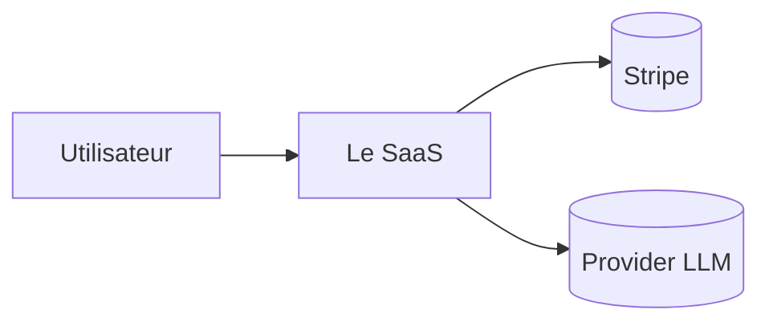

# Référence — Découpage technique (mouvement 3)

Procédure normée pour traduire le découpage **fonctionnel** (features / US du PRD) en découpage **technique** (composants, données, flux). C'est le pont entre le PRD et le futur graphe de tâches de l'étape 10.

## Cadre — C4 (3 niveaux utiles)
On décrit le système à 3 niveaux (modèle **C4** de Simon Brown, libre d'usage), du plus large au plus fin. Diagrammes en **Mermaid** (texte, auto-contenu — aucune dépendance externe, aucun outil à installer).

### Niveau 1 — Contexte
Le système + ses acteurs + les systèmes externes (APIs tierces, provider LLM, paiement). Répond à : qui utilise le produit, à quoi il se connecte.


### Niveau 2 — Conteneurs
Les blocs déployables : frontend (Next.js), backend / API, base de données, workers / queues, stockage. Répond à : de quoi est fait le système, comment les blocs communiquent.

### Niveau 3 — Composants
Dans chaque conteneur, les modules — **en miroir des features**. Une feature du PRD → un ou plusieurs modules techniques. Répond à : où vit chaque feature dans le code.

## Les 4 produits du découpage
1. **Modèle de données.** Depuis les features + user stories, dérive les **entités** et leurs **relations**. Pour chaque entité : champs clés, propriété (quel tenant), règles d'accès (**RLS** — qui lit / écrit). → alimentera `supabase/` (migrations) en Phase 4. Rends un diagramme entité-relation (Mermaid `erDiagram`).
2. **Découpage en modules / services.** Mappe chaque feature Must / Should → module(s). Nomme les **frontières** (ce qui est couplé, ce qui est indépendant). ⚠️ Ça détermine le **parallélisme du build** en Phase 4 : modules à zones disjointes = agents en parallèle ; modules couplés = même lane séquentielle.
3. **Data flow des parcours critiques.** Pour les 2-3 **workflows cœur** (tirés des US), trace le flux : entrée → validation → traitement → persistance → sortie. Marque les points **asynchrones** (jobs, webhooks) et les points de **défaillance**.
4. **Frontières de confiance & sécurité.** Où entrent les données **non fiables** (formulaires, uploads, webhooks) ? Où se fait l'authentification / autorisation (authN / authZ) ? Quelles surfaces sont publiques vs authentifiées ? → alimentera la revue sécurité de la Phase 4.

## Procédure (déterministe)
1. **Niveau 1 (contexte)** depuis `research/idea-brief.md` (écosystème) + le PRD.
2. **Niveau 2 (conteneurs)** depuis l'archétype (`_shared/archetypes/web-saas.md`) — par défaut : frontend Next.js + API + Supabase + Workers + stockage.
3. **Modèle de données** (entités / relations / RLS) depuis features + US.
4. **Niveau 3 (modules)** = features → modules, avec les frontières de couplage.
5. **Data flow** des workflows cœur + **frontières de confiance**.
6. Écris le tout dans `tech/architecture.md` (section 3), diagrammes Mermaid inclus.

## Cas limites (à ne pas oublier — c'est là que se joue le « complet »)
Pour chaque data flow, liste **explicitement** : entrée vide / invalide, échec réseau ou tiers, double soumission (idempotence), concurrence (2 onglets, 2 requêtes), état partiel, limite haute (ex. 10 000 éléments). Ces cas alimentent directement la matrice de tests de la Phase 4 — un cas limite non listé ici est un test qui manquera plus tard.

## Sous-procédures par produit du découpage

### Produit 1 — Modèle de données
Procédure complète, RLS et stratégies multi-tenant : **`data-model.md`** (fichier dédié, high-stakes). En bref : entités depuis les noms des US → champs justifiés par une US → relations (propriété/cascade vs référence/restrict) → tenant + RLS deny-by-default → cas limites de données. Le `tenant_id` se dérive **toujours** du token, jamais du client.

### Produit 2 — Modules & frontières (la carte de parallélisation)
- **Mappe** chaque feature Must/Should → module(s). Pour chaque module, décide **réutiliser un bloc** vs **custom** (`decision-matrices.md §3`) — c'est le split 80/20 qui alimente l'étape 10.
- **Nomme les frontières** : deux modules qui partagent des tables/fichiers = **couplés** ; zones disjointes = **indépendants**.
- **Règle de parallélisme** (pour l'étape 10) :

| Relation entre modules | Conséquence build (Phase 4) |
|---|---|
| Zones de code disjointes | agents **en parallèle** (worktrees séparés) |
| Tables/fichiers partagés | même **lane séquentielle** (éviter les conflits de jonction) |
| Un module dépend de la sortie d'un autre | **ordre imposé** (le dépendant attend) |

### Produit 3 — Data-flow des workflows cœur
- Trace les **2-3** workflows cœur (tirés des US), pas tous. Squelette : `entrée → validation → traitement → persistance → sortie`.
- Marque chaque opération **lourde/tierce** comme point **async** (`decision-matrices.md §5`) et chaque point de **défaillance**.
- Micro-exemple (niche-agnostique) :
```
[UI: soumet un item]
      │  (frontière de confiance: données non fiables → validation serveur)
      ▼
[API: valide + authZ (RLS tenant)] ──invalide──▶ [erreur 4xx, rien persisté]
      │ valide
      ▼
[persiste l'item (statut=en_cours)] ──▶ [enqueue job LLM]   ← point ASYNC
      │                                        │
      ▼                                        ▼
[répond 202 + id]                     [worker: appel LLM] ──échec──▶ [retry borné → statut=échoué]
                                               │ succès
                                               ▼
                                      [maj statut=prêt] ──▶ [notif / realtime UI]
```
Cas limites de ce flow : double soumission (idempotence sur l'id), job rejoué, échec LLM à mi-parcours (état partiel), 2 onglets (concurrence), texte vide/trop long (limite haute).

### Produit 4 — Frontières de confiance & sécurité
- **Où entrent les données non fiables** : formulaires, uploads, webhooks, paramètres d'URL. Toute donnée franchissant une frontière est **validée côté serveur**, jamais présumée sûre parce que le front l'a validée.
- **authN / authZ** : où on identifie (session/JWT) vs où on autorise (RLS, rôles). Le `tenant_id` vient du token.
- **Surfaces publiques vs authentifiées** : liste-les ; une route publique qui écrit en base est un `[SÉCU]`.
- **Webhooks** : signature vérifiée + idempotence (`edge-cases.md E7`).

## Definition-of-Done du découpage
```
[ ] C4 L1 (contexte) + L2 (conteneurs) rendus en Mermaid auto-contenu
[ ] Modèle de données : erDiagram + RLS par table + tenant identifié (data-model.md)
[ ] Chaque feature Must → au moins un module ; chaque module = réutiliser OU custom
[ ] Frontières de couplage nommées (carte de parallélisation pour l'étape 10)
[ ] 2-3 data-flows cœur tracés, points async + points de défaillance marqués
[ ] Frontières de confiance : entrées non fiables, authN/authZ, surfaces publiques/privées
[ ] Cas limites listés par data-flow (= matrice de tests Phase 4)
```

## Modes d'échec (voir `edge-cases.md`)
- **Sur-modélisation / modules figés trop tôt** (E8) : reviens aux entités nommées par les US ; itère le modèle avant de figer les modules.
- **Opération lourde en synchrone** (E6) : bascule en async, marque le point dans le flow.
- **Réinventer un bloc** (E3) : auth/billing/observability = blocs câblés, pas custom.
- **Cas limites oubliés** : chaque oubli = un test manquant en Phase 4.
